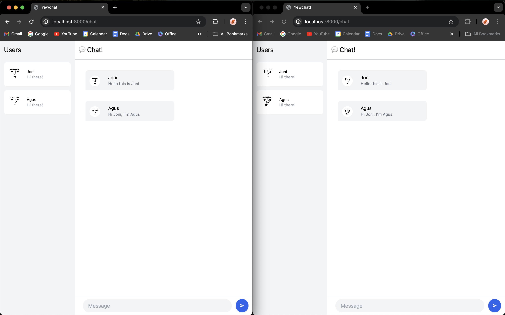

# Tutorial 10
Fikri Risyad Indratno 
2206031170 
Advanced Programming B 

---

## Reflection

### Original Code

### Add some creativities

Since the avatar that is used in the tutorial is outdated, I updated it with a new API endpoint and created a pool containing five seeds of the avatar that would be randomly assigned to UserProfile.